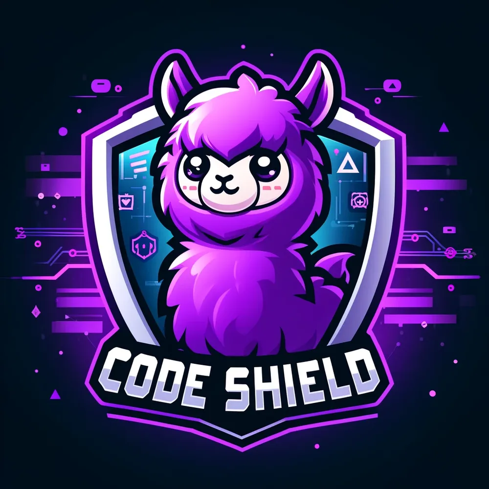

# CodeShield
> Shield against LLM generated insecure code

  

CodeShield is a robust inference time filtering tool engineered to prevent the introduction of insecure code generated by LLMs into production systems. LLMs, while instrumental in automating coding tasks and aiding developers, can sometimes output insecure code, even when they have been security-conditioned.  CodeShield stands as a guardrail to help ensure that such code is intercepted and filtered out before making it into the codebase.
## Overview

LLMs have become an integral part of the coding process, automating coding tasks and serving as a co-pilot for developers. However, our study [CyberSecEval](https://arxiv.org/abs/2312.04724), revealed that it is not uncommon for these code-producing models to inadvertently generate insecure code. This poses a significant risk when developers incorporate this insecure code without verification, especially for those who do not have strong cybersecurity background
CodeShield helps mitigate this risk by intercepting and blocking insecure code generated by LLMs in a configurable way. CodeShield leverages a static analysis library, the Insecure Code Detector (ICD), to identify insecure code. ICD uses a suite of static analysis tools to perform the analysis across 7 programming languages, covering more than 50+ CWEs. For more details, please see  [here](https://github.com/meta-llama/PurpleLlama/tree/main/CodeShield/insecure_code_detector?tab=readme-ov-file#insecure-code-detector)

## Use Cases
CodeShield is designed to be applicable for various scenarios, here are a few example use cases
* LLM is utilized as a coding assistant. CodeShield is an ideal fit for AI Coding assistants integrated with IDEs like VSCode or any other development framework, where it is able to block insecure code suggestions
* Chatbots are used to help with coding tasks. It has become a common practice for developers to ask LLMs for code snippets. Consequently, more and more code is produced by LLMs nowadays. Codeshield is able to fortify any code-producing LLMs by either adding a warning message or completely blocking the response

    
    <figcaption style="text-align: center;">Fig1: Depicting the flow of how CodeShield should be used for output scanning from LLM before the suggestions are propagated for the user facing applications.</figcaption>

## Latency
CodeShield is optimized for production environments where latency is a critical factor for user experience. It is designed to swiftly process the input by a two-layer scanning solution. Specifically, CodeShield will first identify alarming code patterns in the to be scanned content, and perform a more comprehensive analysis if the content is deemed suspicious in the first step.

Our studies indicate that in production environments, over 98% of the traffic is classified as benign and does not necessitate comprehensive scanning. This means that in approximately 99% of cases, requests are processed within a swift 70ms window. For the remaining traffic that requires more thorough scanning, the p90 latency is 450ms in modern production server environments.
This optimization ensures that CodeShield provides robust security without compromising on performance, making it an ideal choice for production environments where both security and speed are crucial.

## Security Signals

CodeShield's primary function is to flag insecure code snippets, acting as a preventative shield to enforce secure coding guidelines. As such, it may not only flag directly exploitable vulnerabilities, but also focuses on enhancing  code hygiene by preventing insecure coding practices.

Signals generated from CodeShield can be used in different ways. For example, one can expedite the productionization of benign code. Some applications might opt to prevent insecure code from being suggested at all. Alternatively, they could display a warning message to developers about potential security issues within a code snippet.

## Getting Started
Follow the instructions and examples as shown in the [notebook](notebook/CodeShieldUsageDemo.ipynb)
