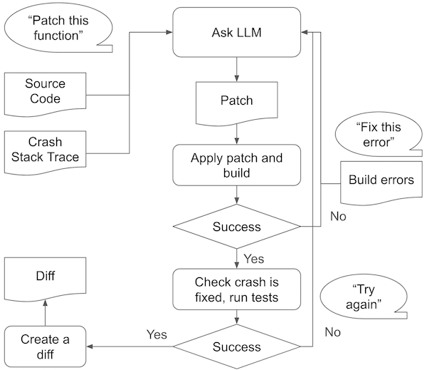
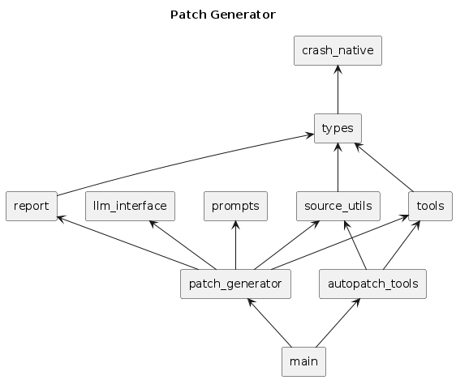

# Reference Implementation of Fuzzing Patch Generator for AutoPatch-Bench

## Summary

The Fuzzing Patch Generator is a tool designed to automatically generate patches
for C/C++ vulnerabilities discovered through fuzzing. It leverages Large
Language Models (LLMs) to analyze vulnerable code and produce appropriate fixes.
The workflow involves:

1. **Vulnerability Analysis**: Identifying the root cause of crashes or
   vulnerabilities found by fuzzing
2. **Context Extraction**: Gathering relevant code context around the vulnerable
   function
3. **Patch Generation**: Using LLMs to generate appropriate code fixes
4. **Validation**: Testing the generated patches against the original fuzzing crash

This reference implementation serves as a convenient standard for evaluating
automated patch generation techniques, particularly for security vulnerabilities
discovered through fuzzing. The tool aims to reduce the manual effort required
in fixing vulnerabilities while maintaining code quality and correctness.

## Design

### Patch Generation Flow Chart

### Dependency Graph

## Known Issues

* TreeSitter CPP v0.21 does not always parse the function correctly. Example:
  `tests/test_files/blocs2.c`.
* Models with a short context window (e.g. ≤ 1M tokens) may struggle to generate
  the complete patched function body when the function is too long. A potential
  improvement to address this limitation is to have the language model generate
  only the code changes, rather than the entire implementation of the patched
  function.
